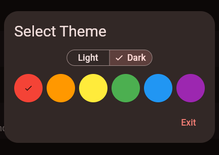

# Configuration

!!! Note
    The default PIN code for accessing configuration options is `000000`

## Device-Specific Configuration

These configuration options are only available on certain platforms;

* [Android Lockdown](androidlock.md) (Android-only)

## Configuration Options

### OAuth Credentials

Credentials can be uploaded to the app from a JSON file, provided during the [account setup stage](../google_setup/account.md#creating-the-json-credentials-for-second).
Only importing credentials is supported. It is recommended to use a USB drive storing credentials.

### Spreadsheet ID

This configuration takes in the sheet ID acquired from the [sheet creation step](../google_setup/sheet.md).

!!! Note
    The service account's email address must be set as an editor in the sheet's permission.

### Log Level

This sets the app's logging level to be used in the Log Viewer, and terminal output (is running on desktop)

### App Theme

The app theme selector allows you to customize the app's appearance.

!!! Note
    Themes can be imported and exported from a JSON configuration.
    A restart may be required for the new theme to apply.

### App Logo

The app logo setting allows you to set a home screen logo.
It is recommended to use 240x240px PNG images for optimal quality.

!!! Note
    Images can be imported and exported from a JSON configuration.
    A restart may be required for the new image to apply.

### Station Locations

The station location options allow you to set the [location options](../ui/member.md#3-location-selection) for clocking in.

You can add, delete, and move location options. The first option is the default when clocking in.

#### Fixed Station

The fixed station option will disable the location selection. All members will be clocked in from a static location, with no drop-down.

### Reset PIN

The reset PIN option will allow you to set a new **global PIN**.
The global PIN is used for accessing configurations, and logs.

!!! Note
    The global PIN does not allow for admin clocking in. 
    Those are stored in the Google Sheet.

### Require PIN for Admin Sign-In

Require a PIN for manual (non-RFID) admin clock in/out.
This setting doesn't affect RFID operation.

### RFID Card Reader Settings

This menu allows you to enable or disable an HID card reader.
More info can be found [here](../rfid.md).

## Import/Export

!!! Warning
    Configuration exports will contain the service account credentials stored in plain text! 
    Do not share your settings exports.

Configurations can be exported as a JSON file, and imported from a JSON file.

!!! Note
    The [Raspberry Pi Installer](../install/rpi.md) will set up USB auto-mount. 
    USB drives are the recommended way for moving configurations.

## Developer Options

The developer settings menu contains undocumented configuration options that may make the app unusable. 
**Do not change them unless you know what you are doing.**