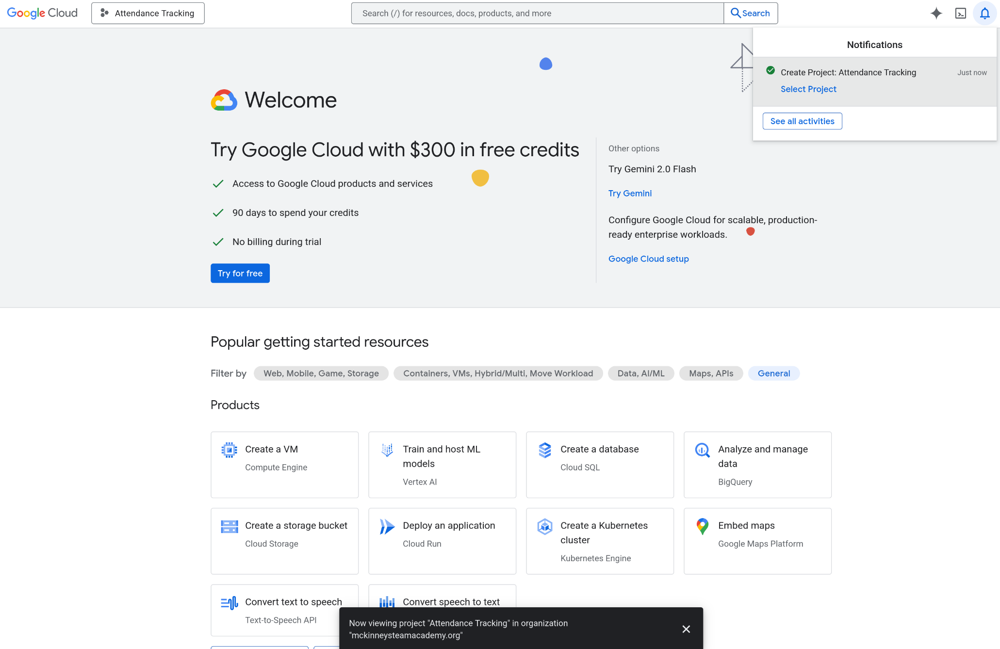
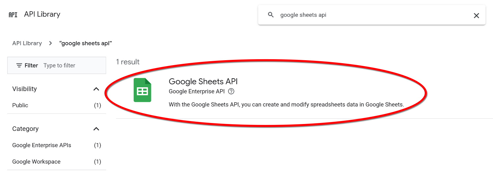
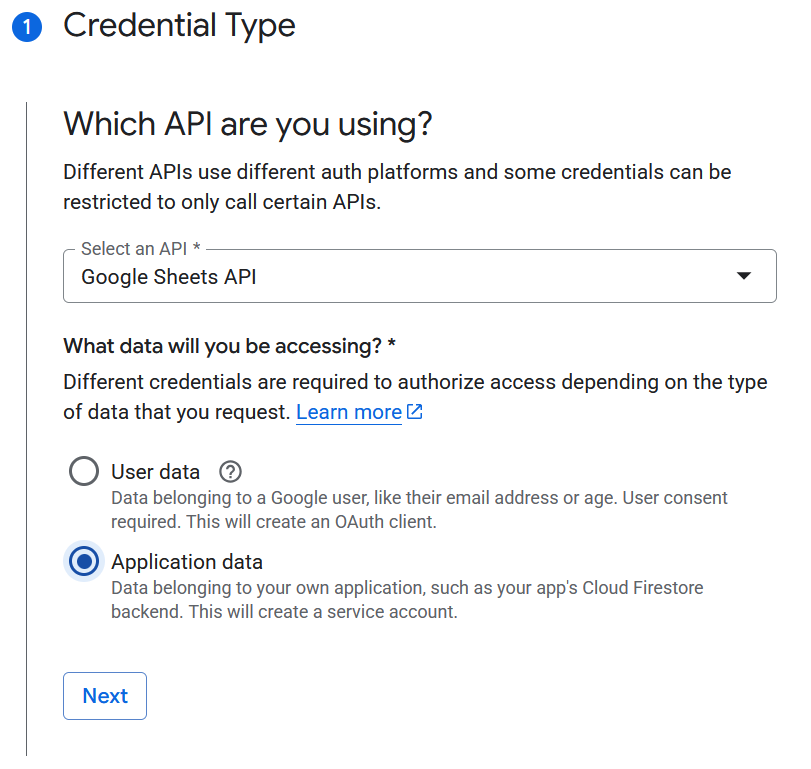
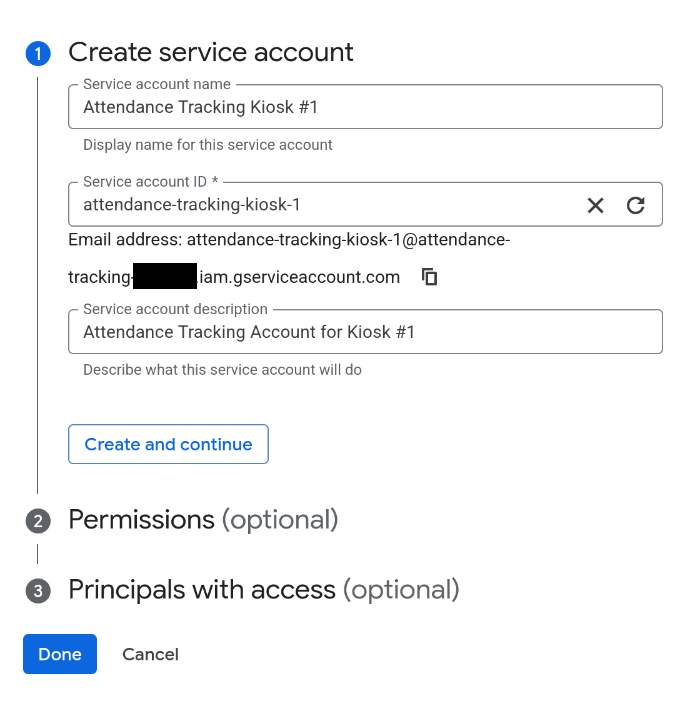
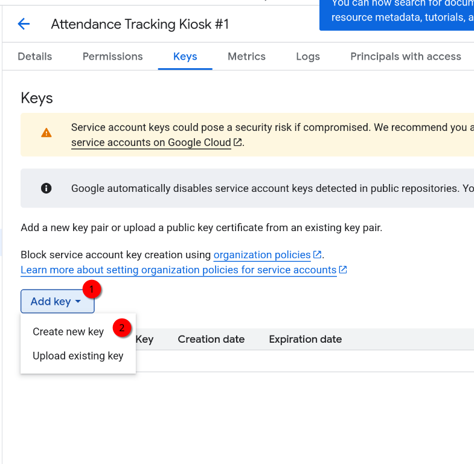
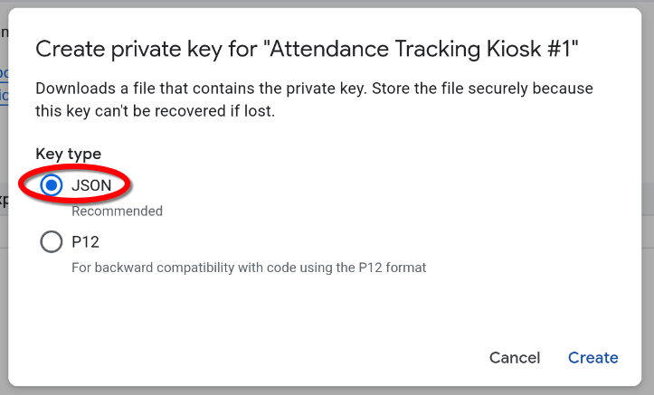

# Google Service Accounts

_Second_ uses a Google Sheet for member lists, status tracking, and log keeping. _Second_ requires a [Service Account](https://cloud.google.com/iam/docs/service-account-overview) to authenticate with Google. This guide will walk you through the steps for setting up a service account with access to the Google Sheets API.

!!! Warning
    You must have the ability to use the Google Cloud Console within your organization. (Only applicable if you are in an organization account)

## Creating a Google Cloud Project

For the Attendance Tracker to be able to talk to Google then the Google Sheet needs to be associated with a ‘Google Project’. 

To create a project go to [https://console.cloud.google.com/projectselector2/](https://console.cloud.google.com/projectselector2/).

Click “Create Project”

On the next window, for the Project Name use "Attendance Tracking". 

Click "Create".

Next you should see a "welcome" screen and indicate "You’re working in Attendance Tracking".

## Adding the Google Sheets API

Click "View all APIs"

Search and Select "Google Sheets API"

Click "Enable" under the API

## Creating the Service Account

Once the API is enabled, you should be redirected to the "APIs & Services" page.
Click "Create Credentials".

Select "Application Data" and continue.

Create your service account.
Add a name, ID, and description.

!!! Tip
    It is **highly recommended** to create separate accounts for each kiosk you may be using. Name them something unique.

!!! Important
    Note down this email address, it will be used when we create the [Template Sheet](sheet.md)

On the next screen in the "Select a role" dropdown type "editor" then select the Editor entry from the drop-down list then click "continue", then finally "Done".

Click "Continue".

Skip the "Principals with access" section, and click "Done".

## Creating the JSON Credentials for _Second_

Now we need to download the credentials we just created so click the “Credentials” tab in the middle of the window **(NOT the Create Credentials we clicked earlier)**.

Select your service account's email.

Go to the "Keys" tab.

Select "Create new key" under the "Add key" drop-down.

Create a "JSON" private key.

Once you click create, a JSON credential file will be downloaded.
Save this file on to a USB drive that you can plug into your kiosk.

!!! Warning
    This file contains the authentication keys for the service account. Store it securely.

## Next Steps

Now that you have your credentials file, it can be imported into _Second_.

[Create the sheet](sheet.md) that _Second_ will use.