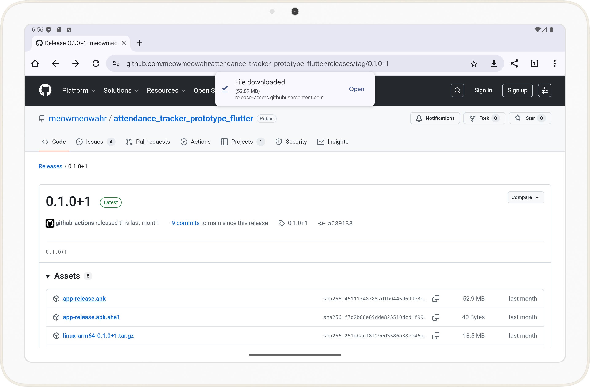
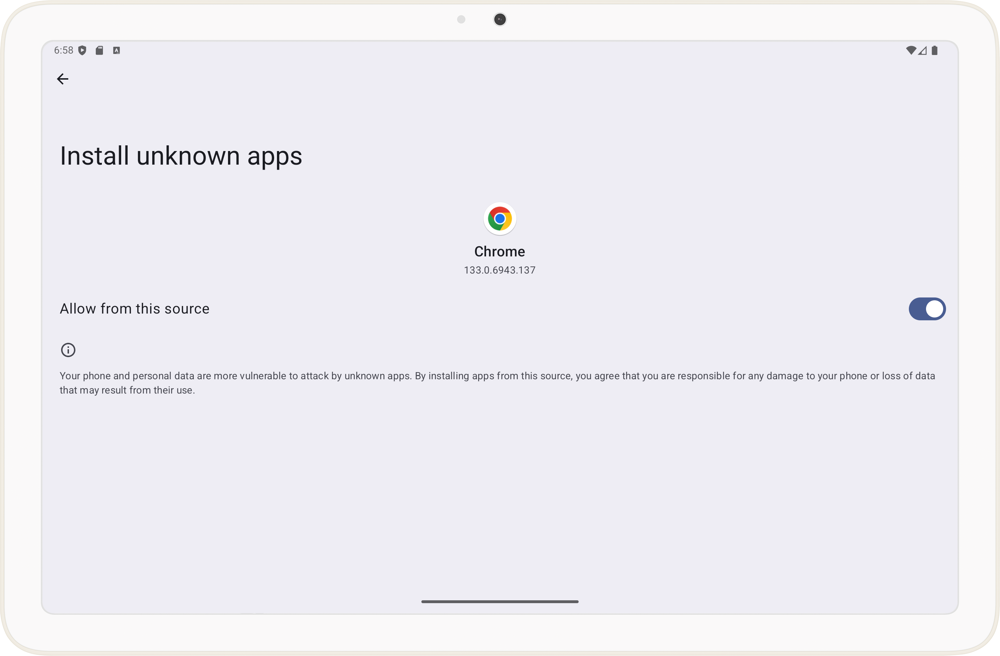
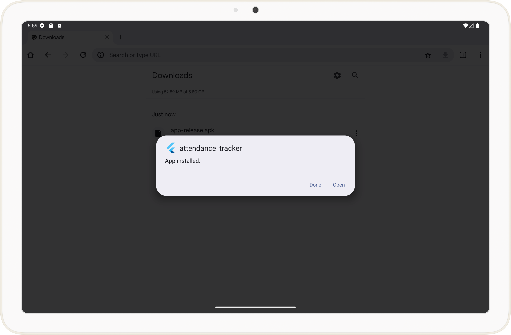

# Android Installation

Android (7+) APK files are available on [Github Releases](https://github.com/meowmeowahr/attendance_tracker_prototype_flutter/releases/latest).

!!! Warning
    The app only supports tablet sized devices (7" or larger). Phones are not supported.

## Installation Steps

#### 1: Download and open the latest APK from [Github Releases](https://github.com/meowmeowahr/attendance_tracker_prototype_flutter/releases/latest)

#### 2: If prompted, allow installation from unknown sources

#### 3: Follow the prompts to install the app

!!! Note
    You may be asked to run a Google Play Protect scan. This may take a while.

#### 4: Open the app

Congratulations, _Second_ is now installed. Repeat this process when updating to a newer version.

Continue to [Configuration](../config/index.md)