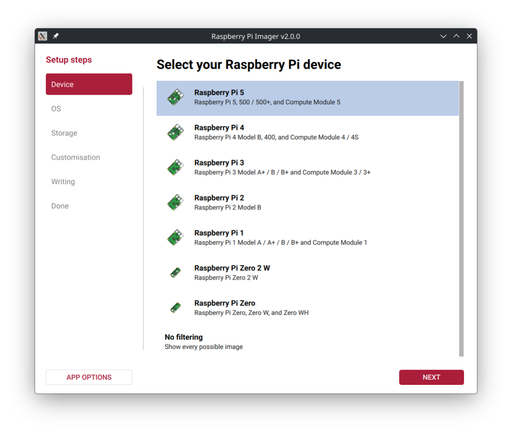
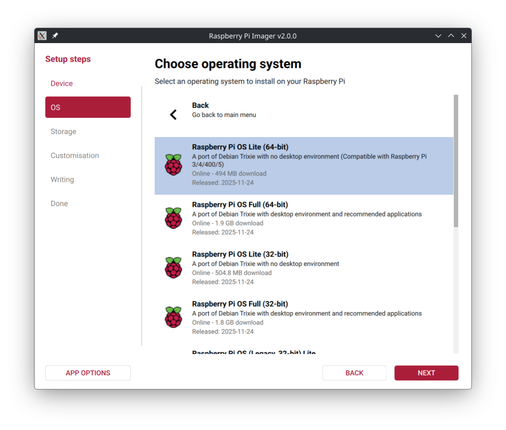

# Raspberry Pi Installation

_Second_ supports a Raspberry Pi 5 running Pi OS Bookworm or newer.
It may be possible to use it on a Pi 4 or older, but this is untested.

An automated installation script is provided to simplify the setup process of a kiosk system.

!!! Warning
    The kiosk installation requires Pi OS Lite.
    Running the installation script on a full Pi OS installation will **NOT WORK**.

## Kiosk Installation

### Requirements

1. Raspberry Pi 5
2. microSD card (8GB or larger)
3. Another computer to flash the microSD card
4. Internet connection
5. Keyboard and mouse (for initial setup)
6. Display (touchscreen recommended for kiosk use)

### Flashing SD card with Pi OS Lite

[Raspberry Pi Imager](https://www.raspberrypi.com/software/) is required to flash the microSD card. This guide is written for Pi Imager 2.0.0 or newer.

1. Select the target board

    

2. Select Pi OS Lite (64-bit)

    Raspberry Pi OS (other) → Raspberry Pi OS Lite (64-bit)
    
    

3. Select the microSD card
    
    Insert the microSD card into your computer and select it in Pi Imager.
    
    !!! Warning
        This will erase all data on the selected drive.
    
    

4. Customization

    Here you will enable SSH and set up Wi-Fi (if not using Ethernet or your kiosk).

    * Hostname
   
        Configure a unique hostname for your Raspberry Pi.
   
    * Localisation
   
        Set your locale, timezone, and keyboard layout.
   
    * User
   
        Set a username and password for the kiosk's user (the kiosk will auto-login).
   
    * Wi-Fi
   
        Configure your Wi-Fi SSID and password. Leave the fields blank if using Ethernet.
   
    * Remote access
   
        Enable SSH to allow remote access to the Raspberry Pi for running the installation script.
   
    * Raspberry Pi Connect
   
        Skip this step. Raspberry Pi Connect will not work with the kiosk setup.

5. Write the image

    Before writing, double-check all settings.

    

    Press _Write_ and for the image to be flashed and verified. 

### Booting the Pi

Insert the flashed microSD card into the Raspberry Pi and power it on.
If using Ethernet, connect the network cable before powering on.

Upon booting the Pi, you will see a **"My IP address is ..."** message.
Take note of the IP address for SSH access.

### Connect to the Pi via SSH

SSH is available on all Macs, Linux systems, and Windows 10 or newer.

You can use your computer's Terminal (Mac, Linux) or Command Prompt (Windows) app to use SSH.

Run the following command, replacing `username` with the username you set during the Pi OS Lite installation, and `ip_address` with the IP address displayed on the Pi:

```shell
ssh username@ip_address
```

You will be asked to accept the Pi's SSH key and enter the password you set during installation.

Once in the Pi's shell, you are ready to complete the next steps.

### Running the Kiosk Installer

Python's Virtual Environment module is required to run the installation script.

Install it with:

```shell
sudo apt install python3-venv
```

Download the installation script:

```shell
curl -SLo install.py https://raw.githubusercontent.com/meowmeowahr/attendance_tracker_prototype_flutter/refs/heads/main/pi_os_installer/main.py
```

Run the installation script with superuser privileges:

!!! Note
    The installation process may take a while (~10-20 minutes).

```shell
sudo python3 install.py
```

Reboot the Pi into the new kiosk environment:

```shell
sudo reboot
```

### Post-Installation

Congratulations! Your Raspberry Pi should now boot directly into the _Second_ kiosk application.

Configure the device by following the guide [here](../config/index.md).