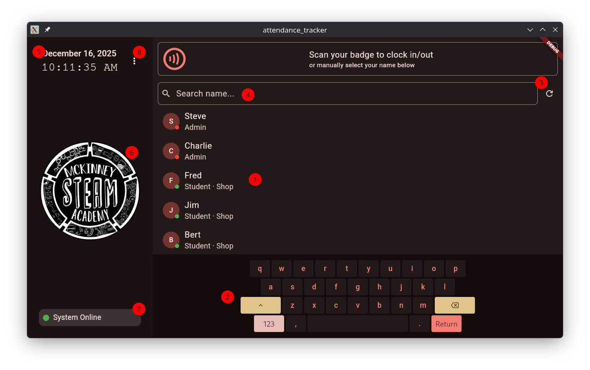

# Home Screen

## UI Elements

### 1. Members List

The members list contains a list of all currently registered members from the [Members Sheet](../google_setup/sheet.md#members-sheet)

### 2. Virtual Keyboard

The virtual keyboard is the **ONLY** way to type into the search bar. A physical keyboard is not supported, **even if RFID is disabled**.

### 3. Manual Members Refresh Button

The manual members refresh button will schedule a re-pull of the members list from the Google Sheet. It will bypass the app's regular timed event scheduling loop.

### 4. Member Search Bar

The member search bar is visual-only. It does not have to be focused to type with the virtual keyboard.

### 5. Date and Time

Date and time representative of the timestamps to be placed in the activity log.

### 6. Organization Logo (configurable)

The organization logo is customizable through the app's configuration. It is recommended to use a 240x240 PNG image for best results.

### 7. Google Sheet Connection Status

The connection status card will show the current status of the Google Sheets backend.

It will say "System Online" if the app is connected to the sheet.

"Connection Lost" will be displayed if any of the following are true:

* No Internet Connection
* Backend is being Rate-Limited
* Sheet ID is incorrect
* Service Account is not authorized or not set up

### 8. Menu

The menu contains items for managing the app's configuration, and viewing error logs (both require the **global admin PIN** to access).